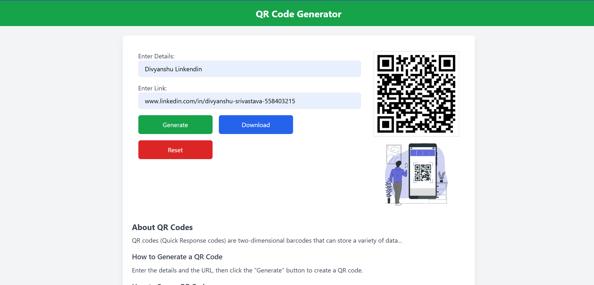

# QR Code Generator 🚀

A simple and efficient **QR Code Generator** built using **JavaScript (QRious.js) and Tailwind CSS**. This tool allows users to generate QR codes instantly from text or links, with options to download or reset the QR code.

## 📌 Features
- **Instant QR Code Generation** – Convert text or links into QR codes quickly.
- **Downloadable QR Codes** – Save QR codes as PNG images.
- **Reset Functionality** – Clear inputs and QR display effortlessly.
- **Responsive UI** – Built with Tailwind CSS for a clean and modern interface.
- **Optimized Performance** – Faster response and improved usability.

## 🛠️ Tech Stack
- **Frontend:** HTML, CSS (Tailwind CSS), JavaScript
- **Libraries:** [QRious.js](https://github.com/neocotic/qrious)

## 🚀 Getting Started

### 1️⃣ Clone the Repository
```sh
git clone https://github.com/yourusername/qr-code-generator.git
cd qr-code-generator
```

### 2️⃣ Open the Project
Simply open `index.html` in your browser.

### 3️⃣ Run Locally (Using Live Server)
If you have VS Code, install the **Live Server** extension and start the project.

## 📸 Screenshots


## 📝 Usage
1. Enter text or a link in the input fields.
2. Click **Generate** to create a QR code.
3. Click **Download** to save the QR code as an image.
4. Click **Reset** to clear inputs and QR code.

## 🎯 Future Enhancements
- Add color customization for QR codes.
- Implement a history log for generated QR codes.
- Provide different QR formats (SVG, PDF).

## 📜 License
This project is open-source and available under the **MIT License**.

## 📬 Contact
For any suggestions or contributions, feel free to reach out via [LinkedIn](https://linkedin.com/in/yourprofile) or create a pull request!

---
💡 *Star this repo if you found it useful!* ⭐
